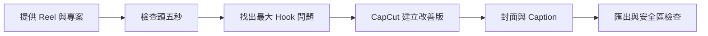

# Hook Doctor

### 讓 AI 找出 Reel 的第一個問題，直接剪出下一個版本。

Hook Doctor 是一個可分享的 AI Agent skill：檢查影片頭 5 秒、提出具體剪法，在 **CapCut 原生專案**完成修改，再交付封面與 Caption。

你提供影片，Agent 負責拆幀、讀字幕、分析、剪輯和檢查。不需要你手動截圖，也不只停在「建議你可以……」。

[開始使用](docs/tutorial.md) · [可複製指令](docs/prompts.md) · [常見問題](docs/faq.md) · [Skill 原文](skills/hook-doctor/SKILL.md)

## 可以幫你做什麼？

| 階段 | 實際交付 |
|---|---|
| Hook 診斷 | 整體及 6 項評分、逐秒分析、First Frame、Retention 結構風險 |
| 剪輯決策 | 一個最大問題、Keep / Cut / Move、具體 0–3 秒重設、5 個不同方向 Hook |
| CapCut 修改 | 建立獨立版本、修改原有字幕與圖層、重排素材、匯出影片 |
| 封面＋Caption | 配合新開場的封面、可直接使用的貼文文案 |
| 品質檢查 | 安全區、內容遮擋、數字、字幕、轉場、實際匯出結果 |



## 一句開始

安裝後，附上影片並輸入：

```text
使用 $hook-doctor，分析這條 Reel 的頭五秒，
在 CapCut 專案「我的影片」建立改善版，
保留原有風格，做埋符合安全區的封面和 Caption。
```

想先看診斷也可以：

```text
使用 $hook-doctor，只做完整 13 部分 Hook 分析，暫時不要剪片。
```

## 開始前需要什麼？

- 可讀取本機影片、查看圖片及載入 `SKILL.md` 的 AI Agent。
- FFmpeg 或同等本機影片工具；附帶拆幀腳本使用 Python 3。
- **要直接剪片：**本機 CapCut、可操作該 App 的電腦控制工具，以及相應權限。
- **要製作封面：**可用的圖片編輯或生成工具。

Skill 是工作方法與輔助腳本，**不附帶 CapCut、AI 訂閱、電腦操作權限或圖片服務**。純文字聊天或無法控制本機的環境，不能只靠安裝 skill 就操作 CapCut。不同 Agent 的安裝與工具支援可能不同。

## 安裝

1. 在本頁選 **Code → Download ZIP**，解壓縮。
2. 把 `skills/hook-doctor` **整個資料夾**交給你的 Agent，請它安裝到目前環境支援的 skills 目錄；不要只複製 `SKILL.md`。
3. 開啟新對話，確認能找到 `hook-doctor`，再附上影片。

```text
請將這個資料夾的 hook-doctor skill 安裝到我的技能目錄，
保留 references、scripts 和 agents 子資料夾，並檢查能否使用。
```

手動安裝與完整示範請看 [教學](docs/tutorial.md)。

## 設計原則

- **原生修改：**調整 CapCut 裡真正的圖層，不用大色塊遮住影片來假裝修改。
- **保留原版：**在獨立專案版本操作，尊重使用者最新的人手修改。
- **風格由你決定：**不綁定任何品牌、顏色、語言、帳戶或私人素材。
- **用證據說話：**評分是內容判斷；Retention Risk 是結構預測，不冒充 Instagram 真實流失數據。
- **封面對得上內容：**不捏造數字，不把兩個案例的差距寫成保證成效。
- **完成後檢查：**以真正匯出檔為準；沒有完成的項目會明確交代。

## 完成後你會收到

```text
已儲存的 CapCut 改善版專案
影片匯出檔
封面圖片
Caption 文案
修改摘要與檢查結果
（需要時）完整 Hook Doctor 報告
```

## 已驗證與限制

本機驗證涵蓋 skill 結構、真實影片 0–5 秒共 11 幀與音訊抽取、短片／無音訊處理、防止覆寫輸出資料夾。原生 CapCut 流程曾於 macOS 操作；尚未逐一驗證所有作業系統、CapCut 版本及 Agent。

不保證爆紅，也不自動發佈 Trial。需要新口播時，會區分原有素材與需要補錄的內容，不會默默仿製你的聲音。

## 參與改進

歡迎提出 Issue 或 Pull Request。請附上作業系統、CapCut 版本、使用的 Agent、預期與實際結果；先移除私人影片、帳戶資料和本機完整路徑。不要提交別人的未公開素材。

## License

[MIT License](LICENSE)。可使用、修改與分享本專案，請保留授權聲明。第三方軟體、模型服務與使用者素材不包含在此授權內。

Created by **Content is Quin**. 本專案並非 Instagram、CapCut 或 OpenAI 的官方產品。
